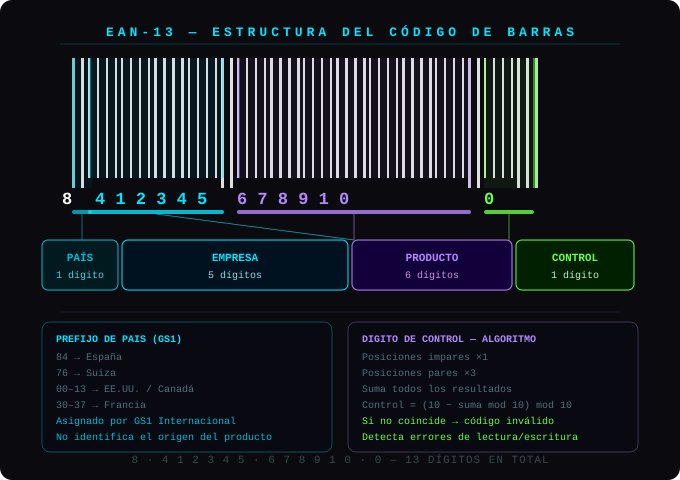

<div align="center">

[;%5B+0.301s+%5D+cli+registered+as+%60ean13%60;%5B+0.335s+%5D+16+tests+%5BPASS%5D;%5B+0.360s+%5D+integrity+check+%5BOK%5D;%5B+0.388s+%5D+ean13-tools+%3A+READY;%3E+BARCODE+ENGINE+ONLINE_)](https://git.io/typing-svg)

# EAN-13 TOOLS · v0.1.0

[](README.md)


-00cfff?style=for-the-badge&labelColor=0d1117)


**Generación · Validación · ASCII · SVG · PNG · CLI · ISO/IEC 15420**

*Modular, profesional y reutilizable. Cero dependencias en el núcleo.*

</div>


## 📚 ÍNDICE

- [⚡ Stack Tecnológico](#-stack-tecnológico)
- [🗂 Arquitectura](#-arquitectura)
- [🎯 Características](#-características)
- [📦 Instalación](#-instalación)
- [💻 API Python](#-api-python)
- [⌨️ CLI](#️-cli)
- [❗ Excepciones](#️-excepciones)
- [🧪 Tests](#-tests)

---

## ⚡ Stack Tecnológico

<div align="center">


</div>

| Módulo | Rol | Deps |
|---|---|---|
| `generator.py` | Algoritmo de dígito de control EAN-13 | — |
| `validator.py` | Validación completa (longitud, caracteres, dígito de control) | — |
| `ascii_renderer.py` | Renderizado ASCII de código de barras usando tablas L/G/R | — |
| `image_renderer.py` | Exportación SVG (integrado) y PNG (Pillow) | Pillow opcional |
| `cli.py` | CLI instalado como comando `ean13` | — |
| `exceptions.py` | Jerarquía de excepciones descriptivas personalizadas | — |

---

## 🗂 Arquitectura

```
ean13-tools/
│
├── ean13_tools/
│   ├── __init__.py          ← API pública del paquete
│   ├── generator.py         ← Cálculo de dígito de control
│   ├── validator.py         ← Validación ISO/IEC 15420
│   ├── ascii_renderer.py    ← Código de barras ASCII (tablas L, G, R)
│   ├── image_renderer.py    ← SVG integrado · PNG vía Pillow
│   ├── cli.py               ← Comando de terminal `ean13`
│   └── exceptions.py        ← Jerarquía de excepciones personalizadas
│
└── tests/
   └── test_ean13.py        ← 16 tests · pytest

```

---

## 🎯 Características

```
✔  Generar EAN-13 válido desde un prefijo de 12 dígitos
✔  Validar EAN-13 completo (modo bool o modo raise)
✔  Renderizado ASCII en terminal usando bloques █
✔  Exportar a SVG sin dependencias externas
✔  Exportar a PNG vía Pillow (dependencia opcional)
✔  CLI instalable: comando `ean13` disponible globalmente
✔  Excepciones descriptivas con mensajes de error exactos
✔  16 tests automatizados con pytest
```


---

## 📦 Instalación

**Core — sin dependencias externas:**
```bash
pip install ean13-tools
```

**Con soporte PNG (Pillow):**
```bash
pip install "ean13-tools[image]"
```

**Modo desarrollo (editable):**
```bash
git clone https://github.com/ogclau/ean13tools
cd ean13-tools
pip install -e .
```

**Verificar instalación:**
```bash
ean13 --help
```

---

## 💻 API Python

### Generar EAN-13

```python
from ean13_tools import generate_ean13

code = generate_ean13("590123412345")
print(code)  # → 5901234123457
```

### Validar

```python
from ean13_tools import validate_ean13

validate_ean13("5901234123457")          # → True
validate_ean13("5901234123450")          # → False

# Modo estricto — lanza una excepción descriptiva
validate_ean13("5901234123450", raise_on_error=True)
# → InvalidCheckDigitError: expected 7, got 0
```

### ASCII en terminal

```python
from ean13_tools import render_ascii

print(render_ascii("5901234123457"))
# █ █   █ ██ █  ███ ██  ██  █  ██ ████ ...
# 5   9  0  1  2  3  4    1  2  3  4  5  7
```

### Exportar SVG

```python
from ean13_tools import render_svg

# Como string
svg_str = render_svg("5901234123457")

# Como archivo
render_svg("5901234123457", path="barcode.svg")
```

### Exportar PNG *(requiere Pillow)*

```python
from ean13_tools import render_png

render_png("5901234123457", path="barcode.png")
render_png("5901234123457", path="barcode@2x.png", scale=4)
```

---

## ⌨️ CLI

Una vez instalado, el comando `ean13` está disponible en cualquier terminal:

```bash
# Generar EAN-13 desde un prefijo de 12 dígitos
ean13 generate 590123412345
# → 5901234123457

# Validar (exit 0 = válido · exit 1 = inválido)
ean13 validate 5901234123457   # ✓  5901234123457  →  válido
ean13 validate 5901234123450   # ✗  5901234123450  →  INVÁLIDO

# Código de barras ASCII en terminal
ean13 ascii 5901234123457
ean13 ascii 5901234123457 --height 12

# Exportar SVG
ean13 svg 5901234123457 output.svg

# Exportar PNG
ean13 png 5901234123457 output.png
```

> La CLI devuelve **código de salida 1** cuando un código es inválido, haciéndola scripteable:
> ```bash
> if ean13 validate "$CODE"; then echo "OK"; else echo "Código inválido"; fi
> ```

---

## ⚠️ Excepciones

Todas las excepciones heredan de `EAN13Error` — captúralas de forma general o individual:

```python
from ean13_tools import EAN13Error, InvalidCheckDigitError

try:
    validate_ean13("1234567890000", raise_on_error=True)
except InvalidCheckDigitError as e:
    print(e)   # Invalid check digit: expected 5, got 0
except EAN13Error as e:
    print(e)   # cualquier otro error del paquete
```

| Excepción | Cuándo se lanza |
|---|---|
| `EAN13Error` | Clase base — captura todos los errores del paquete |
| `InvalidPrefixLengthError` | El prefijo no tiene exactamente 12 dígitos |
| `InvalidLengthError` | El código no tiene exactamente 13 dígitos |
| `InvalidCharactersError` | Contiene caracteres no numéricos |
| `InvalidCheckDigitError` | El dígito de control es incorrecto |

---

## 🧪 Tests

```bash
pip install pytest
pytest tests/ -v

# 16 passed in 0.04s ✓
```

<div align="center">


*Construido con Python puro · ISO/IEC 15420 · Diseñado para reutilizarse*


</div>
